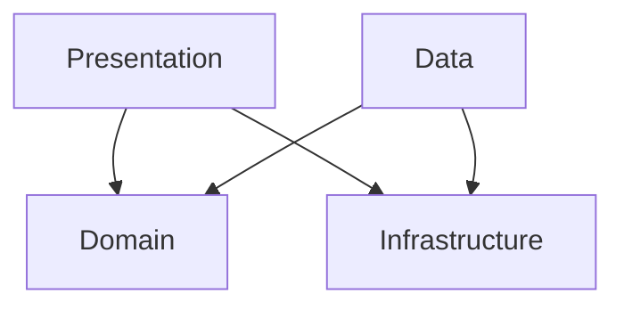

# KakaoImageSearch

이미지 검색과 북마크 기능을 구현한 SwiftUI 기반 iOS 앱입니다.  
Clean Architecture와 MVVM을 바탕으로 구성했고, Swift Concurrency를 활용해 비동기 흐름을 관리했습니다.  
debounce 검색, 페이지네이션, 북마크 영속화, 이미지 캐싱, iPad 대응 레이아웃을 포함합니다.  
외부 라이브러리 없이 핵심 컴포넌트를 직접 구현했고 테스트 코드로 주요 동작을 검증했습니다.  
프로젝트 문서에는 실행 방법, 설계 의도, 예외 처리, 개선 방향을 정리했습니다.

---


## 기술 스택

| 항목 | 내용 |
|------|------|
| **언어** | Swift 6.0 (Strict Concurrency) |
| **UI** | SwiftUI |
| **최소 타겟** | iOS 17.0 |
| **외부 라이브러리** | 없음 (Zero dependency) |
| **테스트** | Swift Testing Framework |
| **로깅** | OSLog (카테고리별 필터링) |

---

## 아키텍처

Clean Architecture + MVVM을 기반으로 4개 레이어로 구성했습니다.

```
KakaoImageSearch
├── Domain          # 비즈니스 규칙 (Entity, UseCase, Repository Protocol)
├── Data            # 외부 데이터 (DTO, Repository 구현체, Storage)
├── Infrastructure  # 인프라 (Network, ImageLoader, L10n, OSLog Logger)
└── Presentation    # UI (View, ViewModel)
```

### 레이어 의존 방향



Domain은 외부에 의존하지 않으며, Data와 Presentation이 Domain과 Infrastructure의 인터페이스에 의존합니다.

---

## 주요 구현

### Swift 6 Strict Concurrency
- `SWIFT_DEFAULT_ACTOR_ISOLATION = MainActor` 설정으로 전체 타입 기본 격리
- `actor`: NetworkService, BookmarkStorage, ImageDownloader, ImageCache
- `@Observable @MainActor final class`: 모든 ViewModel
- `nonisolated`: actor 격리가 필요하지 않은 APIEndpoint, OSLog Logger, DTO 초기화, L10n 등에 명시적으로 적용

### 자체 구현 컴포넌트 (외부 라이브러리 미사용)
| 컴포넌트 | 구현 내용 |
|----------|-----------|
| **NetworkService** | `actor` 기반 Generic URLSession 래퍼, snake_case 자동 변환 |
| **ImageDownloader** | 메모리(NSCache) + 디스크 2단계 캐시(`.completeFileProtection`), in-flight 중복 요청 dedup(호출자 취소 내성), Content-Type·크기 검증(Content-Length 사전 검사 + 스트리밍 중 조기 중단), prefetch 병렬도 제한(최대 6), URLSession 주입 가능 |
| **CachedAsyncImage** | `.task(id:)` 기반 이미지 로더 — 상태 전이 로직을 ViewModel로 분리해 테스트 가능하게 구성, 뷰 수명과 Task 수명 일치, URL 변경 시 이전 상태를 정리하고 새 이미지를 로드, 로드 실패 시 셀 탭으로 재시도(최대 3회, 초과 시 영구 실패 표시), 재시도 불가 에러(포맷·크기)는 즉시 영구 실패 처리 |
| **AppAssembler** | Composition Root 패턴, 주요 의존성은 AppAssembler에서 조립하도록 구성했습니다. |
| **BookmarkStorage** | FileManager + JSON 파일 기반 영속성, `.atomic` + `.completeFileProtection` 쓰기 |

### 검색 Debounce 및 취소 처리
- `Task.sleep(for: .seconds(1.0))` + `Task.cancel()` 조합으로 1.0초 debounce 구현
- `searchTask`로 진행 중인 검색 Task를 추적해 새 검색 시 이전 Task 명시적 취소
- `NetworkService`에서 `CancellationError` / `URLError(.cancelled)` 를 `NetworkError`로 감싸지 않고 그대로 전파해 취소와 실제 오류를 명확히 구분
- `activeSearchID`(UUID)로 stale 응답 무시 — 취소 신호가 미처 전달되기 전에 응답이 도착해도 이전 검색 결과가 UI에 반영되지 않도록 처리
- `submitSearch`는 `@discardableResult Task<Void, Never>` 반환 — 프로덕션에서는 결과를 무시하고, 테스트에서는 `.value`로 await해 안정적인 테스트 타이밍 확보

### 페이지네이션
- Kakao API의 `page` 파라미터를 활용해 추가 결과를 자동 로드
- `LazyVGrid` 마지막 아이템 `.onAppear` 시점에 `loadMore()` 호출
- API의 `isEnd` 플래그로 마지막 페이지 판별
- API 페이지 제한(15페이지) 도달과 실제 결과 소진을 구분해 안내 문구를 다르게 표시

### 네트워크 오류 재시도 UX
- 검색 실패(`.error`) 시 EmptyStateView에 재시도 버튼 표시
- 추가 로드 실패(`.loadMoreError`) 시 목록 하단에 인라인 재시도 버튼 표시
- 북마크 로드 실패(`.error`) 시 EmptyStateView에 에러 메시지와 재시도 버튼 표시
- 결과 없음(빈 배열)과 실제 오류를 구분해서 보여주도록 구성

### 북마크 에러 피드백
- 북마크 로드 실패 시 EmptyStateView에 재시도 버튼 표시
- 북마크 토글 실패 시 목록을 유지한 채 하단 Toast로 표시 (3초 후 자동 소멸, 슬라이드 인/아웃 애니메이션)

### ATS 예외 설정
- 일부 검색 결과 이미지 CDN이 HTTPS를 지원하지 않고, 실제 이미지 호스트도 여러 서브도메인으로 분산되어 있어 `daum.net`, `naver.net` 계열 도메인에 ATS 예외를 적용했습니다.
- 이 예외는 검색 결과 이미지 로딩에만 사용하며, API 통신이나 민감 정보 전송에는 적용하지 않습니다. 현재 과제 범위에서는 호스트 구성이 다양해 이 방식이 가장 현실적이었고, 사용 호스트를 더 좁힐 수 있다면 예외 범위도 함께 축소할 수 있습니다.

### BookmarkStore (공유 상태 관리)
- `Presentation/Store/`에 위치한 Presentation 레이어 공유 상태 객체
- `@Observable @MainActor`로 선언해 북마크 상태를 중앙 관리
- `SearchViewModel` / `BookmarkViewModel` 이 동일 인스턴스를 참조해 양쪽 탭에서 같은 북마크 상태를 참조하도록 구성했습니다.

### iPad 적응형 레이아웃
- `horizontalSizeClass` 기반으로 iPhone / iPad 레이아웃 분기
- **iPhone (compact)**: 기존 `TabView` 유지, 북마크 탭에서 검색 submit 시 검색 탭으로 자동 전환
- **iPad (regular)**: `NavigationSplitView`로 검색(사이드바) + 북마크(디테일) 동시 표시
- 이미지 목록: `LazyVGrid` 2열, 좌우 패딩 20pt, 컬럼 간격 20pt

### 다국어 지원 (ko / en / ja)
- `.xcstrings` String Catalog 기반
- `L10n` 헬퍼를 사용해 문자열 접근을 정리했습니다

### VoiceOver 접근성
- `BookmarkButton`: 북마크 상태에 따라 `accessibilityLabel`과 `accessibilityHint`를 분기 적용
- `SearchBar`: 텍스트필드에 debounce 안내 `accessibilityHint`, 지우기 버튼에 `accessibilityLabel` 적용
- `SearchResultItemView`: 이미지 크기 정보를 포함한 `accessibilityLabel` 적용
- `EmptyStateView`: 메시지 영역에 `accessibilityLabel`, 재시도 버튼에 `accessibilityHint` 적용
- `ToastView`: 등장 시 `AccessibilityNotification.Announcement`로 VoiceOver 자동 안내
- `ProgressView`: 검색/북마크 로딩 상태에 `accessibilityLabel` 적용
- 탭(검색/북마크): `accessibilityHint`로 탭 전환 시 역할 안내
- 추가 로드 재시도 버튼: `accessibilityHint` 적용
- 접근성 문자열은 `L10n.Accessibility`에서 관리하며, 한국어/영어/일본어를 지원합니다.

### OSLog 기반 로깅
- `Logger.network`, `Logger.imageLoader`, `Logger.bookmark`, `Logger.presentation` 카테고리 분리
- `debugPrint` / `errorPrint` 헬퍼로 `OS_ACTIVITY_MODE=disable` 환경에서도 Xcode 콘솔 출력 보장

---

## 테스트

### 유닛 테스트

Swift Testing Framework 기반 110개 테스트 케이스를 작성했고, 로컬 기준으로 모두 통과했습니다.

| 테스트 Suite | 케이스 수 | 주요 검증 항목 |
|---|---|---|
| `ImageItemTests` | 14 | aspectRatio 경계값, Codable 라운드트립, Hashable, displayURL fallback |
| `SearchImageUseCaseTests` | 5 | 검색 결과 반환, 에러 전파, 쿼리/페이지 전달 |
| `ManageBookmarkUseCaseTests` | 10 | toggle add/remove, 중복 방지 |
| `KakaoImageSearchEndpointTests` | 16 | URL 구성, 쿼리 파라미터, 헤더 검증, query/page/size 입력 클램핑 |
| `KakaoSearchResponseDTOTests` | 12 | JSON 디코딩, snake_case 변환, 필드 fallback, URL 스킴 검증 (javascript:/file: 거부) |
| `SearchViewModelTests` | 30 | 검색 성공/실패, 취소/race condition 처리, 페이지네이션, API 페이지 제한 vs 결과 소진 구분, 재시도, 북마크 토글/Toast, 연속 토글 dedup, loadMore/prefetch Task 취소 |
| `BookmarkViewModelTests` | 7 | 목록 로드/실패, 로드 재시도 성공, 토글 후 갱신, 토글 실패 Toast, 연속 토글 dedup |
| `BookmarkStoreTests` | 5 | load 성공/실패(throws), toggle 추가/제거, isBookmarked 판별 |
| `CachedAsyncImageViewModelTests` | 7 | Phase 상태 전이(성공/실패/영구실패), 재시도 횟수 초과, 재시도 불가 에러 즉시 실패, retryCount 초기화 |
| `MainViewModelTests` | 4 | debounce 취소, 빈 입력 처리 |

Domain과 ViewModel 중심으로 테스트를 작성했습니다.

### 통합 테스트

Swift Testing Framework 기반 45개 테스트 케이스, 작성한 테스트는 로컬 기준으로 모두 통과했습니다.

| 테스트 Suite | 케이스 수 | 주요 검증 항목 |
|---|---|---|
| `NetworkServiceIntegrationTests` | 9 | MockURLProtocol 기반 실제 URLSession 요청/응답, 에러 매핑, 타임아웃 |
| `BookmarkStorageIntegrationTests` | 14 | 실제 FileManager 파일 I/O, 저장/조회/삭제, 읽기전용 경로 에러, 손상 JSON 에러, 앱 재시작 영속성 |
| `ImageDownloaderIntegrationTests` | 16 | MockImageURLProtocol 기반 다운로드 성공/실패, 캐시 히트, in-flight dedup(호출자 취소 내성), prefetch 병렬도 제한·부분 실패, Content-Type 검증, Content-Length 사전 검사·스트리밍 크기 제한, http→https 변환 |
| `ImageCacheIntegrationTests` | 6 | 손상 파일 자동 삭제 후 nil 반환, 재캐싱 복구, TTL 초과 파일 삭제, TTL 유효 파일 유지, 디스크 용량 초과 시 LRU 삭제, 용량 이하 시 유지 |

### UI 테스트

XCUITest 기반 UI 테스트 25개 + Launch Test 1개를 작성했고, 로컬 기준으로 모두 통과했습니다.

| 테스트 Suite | 케이스 수 | 주요 검증 항목 |
|---|---|---|
| `KakaoImageSearchIPhoneUITests` | 15 | 앱 실행, 검색창 인터랙션, 탭 전환, 검색 결과, 네트워크 오류 재시도 UX (`--useFixtureData` / `--simulateNetworkError`, iPhone 전용) |
| `KakaoImageSearchIPadUITests` | 10 | NavigationSplitView 구조, 양쪽 패널 동시 표시, 네트워크 오류 재시도 UX (`--useFixtureData` / `--simulateNetworkError`, iPad 전용) |

---

## 실행 방법

1. 저장소 클론
2. 프로젝트 루트에 `KakaoAPIKey.swift` 파일을 생성

```swift
// KakaoAPIKey.swift
enum KakaoAPIKey {
    static let restAPIKey = "여기에_REST_API_키_입력"
}
```

3. Xcode에서 `KakaoImageSearch.xcodeproj` 실행
4. iOS 17.0 이상 시뮬레이터 또는 실기기에서 빌드 & 실행

> `KakaoAPIKey.swift`는 `.gitignore`에 등록되어 있습니다.

---

## 프로젝트 구조

```
KakaoImageSearch/
├── App/                        # AppAssembler (Composition Root)
├── Infrastructure/
│   ├── ImageLoader/            # ImageDownloader, ImageCache, CachedAsyncImage
│   ├── Logger/                 # AppLogger (OSLog extension)
│   ├── Network/                # NetworkService, NetworkError, APIEndpoint
│   └── L10n.swift              # 다국어 헬퍼
├── Domain/
│   ├── Entity/                 # ImageItem
│   ├── Repository/             # ImageSearchRepository, BookmarkRepository (Protocol)
│   └── UseCase/                # SearchImageUseCase, ManageBookmarkUseCase
├── Data/
│   ├── API/                    # KakaoImageSearchEndpoint
│   ├── DTO/                    # KakaoSearchResponseDTO
│   ├── Repository/             # DefaultImageSearchRepository, DefaultBookmarkRepository
│   └── Storage/                # BookmarkStorage
└── Presentation/
    ├── Store/                  # BookmarkStore (Presentation 레이어 공유 상태)
    ├── Main/                   # MainView, MainViewModel
    ├── Search/                 # SearchView, SearchViewModel, SearchResultItemView
    ├── Bookmark/               # BookmarkView, BookmarkViewModel
    └── Components/             # SearchBar, BookmarkButton, EmptyStateView, ToastView
```
