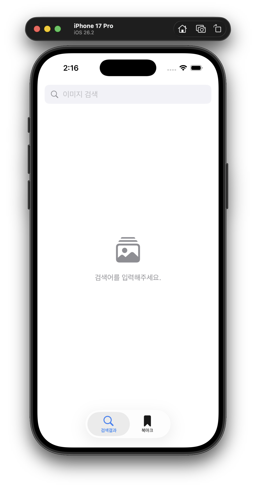
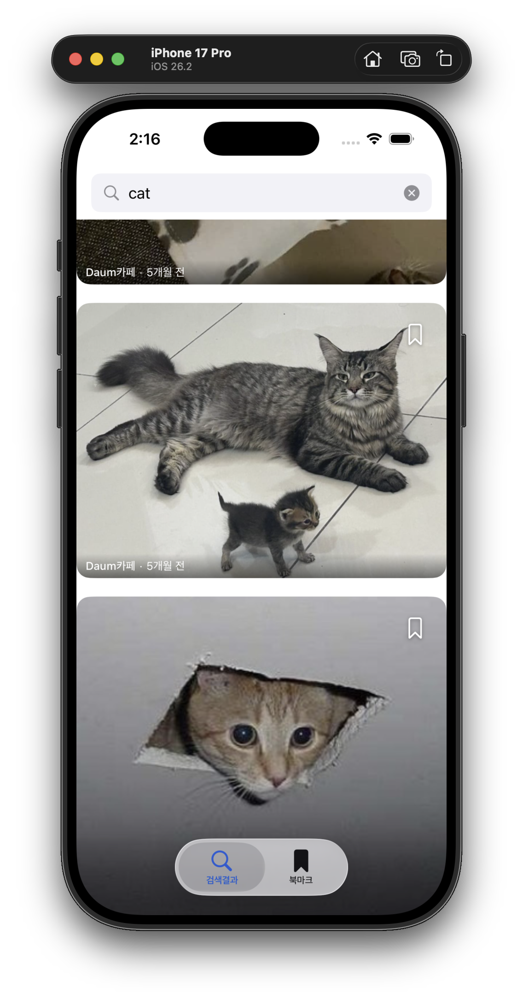
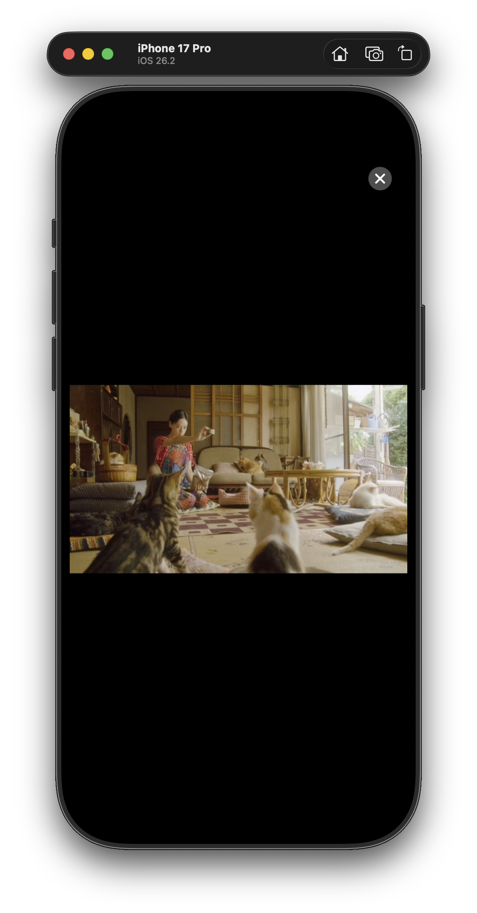
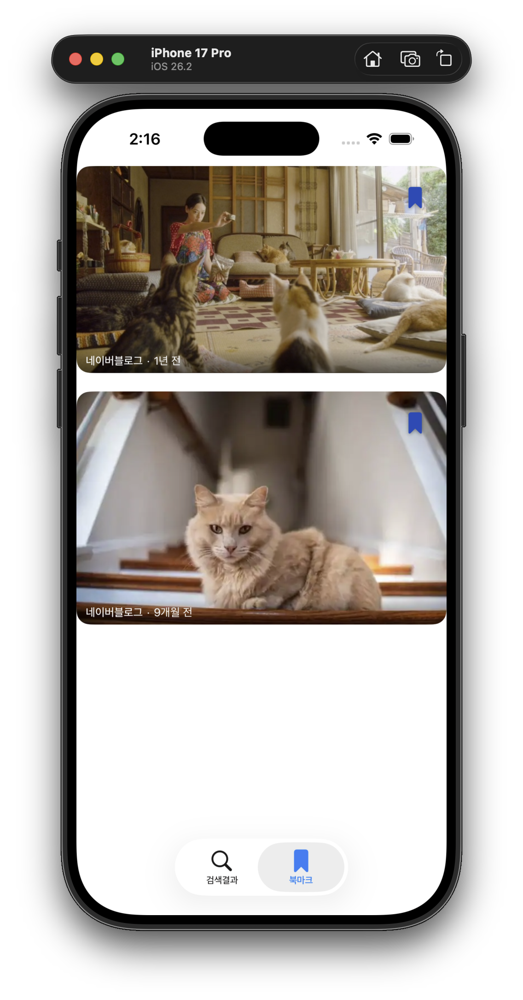
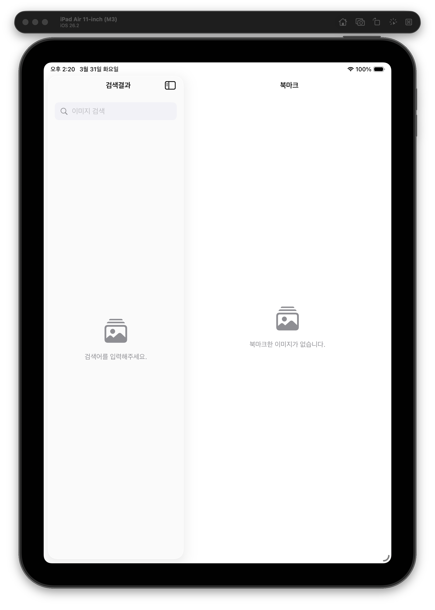
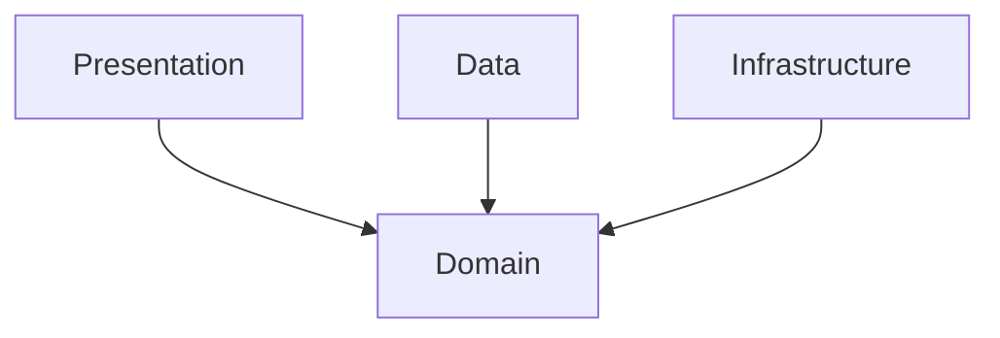

# KakaoImageSearch


이미지 검색 · 상세 뷰어 · 북마크 관리를 지원하는 **SwiftUI 기반 iOS 앱**입니다.
대량 이미지의 효율적 로딩, 캐싱, 페이지네이션에 초점을 두었으며,
**Network Layer, Image Downloader, DI, Cache**를 직접 구현했습니다.
**Clean Architecture + MVVM** 구조를 바탕으로 **상태 분리, 실패 복구, 테스트 가능성**을 우선해 구성했습니다.


## Screenshots

<p align="center">
  
  
</p>
<p align="center">
  
  
</p>
<p align="center">
  
</p>

## Quick Guide
- **1초 debounce** 후 자동 검색
- **검색 결과 / 북마크 탭 간 상태 동기화**
- **페이지네이션, stale response 방지, 재시도 UI** 지원
- **iPhone(세로 고정) / iPad 레이아웃 분리 대응**
- **Unit / Integration / UI Test** 포함

이 프로젝트는 기능 확장보다 **일관된 상태 관리와 안정적인 사용자 경험**에 중점을 두었습니다.  
실행 방법, 설계 의도, 예외 처리 방침, 개선 방향은 아래 문서와 섹션에 정리했습니다.

### 실행 방법
1. 프로젝트 루트에 `KakaoAPIKey.swift` 생성 후 카카오 API 키 추가
2. `KakaoImageSearch.xcodeproj` 실행
3. iOS 17.0+ 시뮬레이터 또는 실기기에서 빌드

샘플 키 파일은 `KakaoAPIKey.swift.example`에 포함되어 있습니다.

### 빌드 & 테스트 (CLI)

```bash
# 빌드
xcodebuild -project KakaoImageSearch.xcodeproj -scheme KakaoImageSearch \
  -destination 'platform=iOS Simulator,name=iPhone 17' build

# 유닛 + 통합 테스트
xcodebuild -project KakaoImageSearch.xcodeproj -scheme KakaoImageSearch \
  -destination 'platform=iOS Simulator,name=iPhone 17' test

# UI 테스트만
xcodebuild -project KakaoImageSearch.xcodeproj -scheme KakaoImageSearch \
  -destination 'platform=iOS Simulator,name=iPhone 17' \
  -only-testing:KakaoImageSearchUITests test
```

### 빠르게 보면 좋은 파일
- `README.md` : 실행 방법 / 구조 요약
- `DEVELOPMENT.md` : 설계 의도 / 예외 처리 / 개선 포인트
- `KakaoImageSearchTests/` : 핵심 테스트 케이스

## 기술 스택

| 항목 | 내용 |
|------|------|
| **언어** | Swift 6.0 (Strict Concurrency) |
| **UI** | SwiftUI |
| **영속성** | SwiftData |
| **최소 타겟** | iOS 17.0 |
| **외부 라이브러리** | 없음 (Zero dependency) |
| **테스트** | Swift Testing Framework |
| **로깅** | OSLog (카테고리별 필터링) |

---

## 아키텍처

Clean Architecture + MVVM을 기반으로 4개 레이어로 구성했습니다.

```
KakaoImageSearch
├── Domain          # 비즈니스 규칙 (Entity, UseCase, Repository/Service Protocol)
├── Data            # 외부 데이터 (DTO, Repository 구현체, Storage)
├── Infrastructure  # 인프라 (Network, ImageLoader)
├── Presentation    # UI (View, ViewModel, L10n)
└── App             # Composition Root (DI 조립, Environment 정의)
```

### 레이어 의존 방향



Domain은 외부에 의존하지 않으며, 나머지 레이어는 Domain의 프로토콜에만 의존합니다.
App(Composition Root)이 전체를 조립하고 구체 타입을 주입합니다.

---

## 주요 구현

### Swift 6 Strict Concurrency
- `SWIFT_DEFAULT_ACTOR_ISOLATION = MainActor` 설정으로 전체 타입 기본 격리
- `actor`: NetworkService, ImageDownloader, ImageCache
- `@ModelActor`: BookmarkStorage (SwiftData)
- `@Observable @MainActor final class`: 모든 ViewModel
- `nonisolated`: actor 격리가 필요하지 않은 APIEndpoint, OSLog Logger, DTO 초기화, L10n 등에 명시적으로 적용

### 자체 구현 컴포넌트 (외부 라이브러리 미사용)
| 컴포넌트 | 구현 내용 |
|----------|-----------|
| **NetworkService** | `actor` 기반 Generic URLSession 래퍼, snake_case 자동 변환 |
| **ImageDownloader** | 메모리(NSCache) + 디스크 2단계 캐시(`.completeFileProtection`), in-flight 중복 요청 dedup(호출자 취소 내성), Content-Type·크기 검증(Content-Length 사전 검사 + 스트리밍 중 조기 중단), prefetch 병렬도 제한(최대 6), URLSession 주입 가능 |
| **CachedAsyncImage** | `.task(id:)` 기반 이미지 로더 — 상태 전이 로직을 ViewModel로 분리해 테스트 가능하게 구성, 뷰 수명과 Task 수명 일치, URL 변경 시 이전 상태를 정리하고 새 이미지를 로드, 로드 실패 시 셀 탭으로 재시도(최대 3회, 초과 시 영구 실패 표시), 재시도 불가 에러(포맷·크기)는 즉시 영구 실패 처리 |
| **AppAssembler** | Composition Root 패턴, 주요 의존성은 AppAssembler에서 조립하도록 구성했습니다. |
| **BookmarkStorage** | SwiftData `@ModelActor` 기반 영속성, in-memory 테스트 가능, `@Attribute(.unique)` 중복 방지 |

### 검색 Debounce 및 취소 처리
- `Task.sleep(for: .seconds(1.0))` + `Task.cancel()` 조합으로 1.0초 debounce 구현
- `searchTask`로 진행 중인 검색 Task를 추적해 새 검색 시 이전 Task 명시적 취소
- `NetworkService`에서 `CancellationError` / `URLError(.cancelled)` 를 `NetworkError`로 감싸지 않고 그대로 전파해 취소와 실제 오류를 명확히 구분
- `activeSearchID`(UUID)로 stale 응답 무시 — 취소 신호가 미처 전달되기 전에 응답이 도착해도 이전 검색 결과가 UI에 반영되지 않도록 처리
- `submitSearch`는 `@discardableResult Task<Void, Never>` 반환 — 프로덕션에서는 결과를 무시하고, 테스트에서는 `.value`로 await해 안정적인 테스트 타이밍 확보

### 페이지네이션
- Kakao API의 `page` 파라미터를 활용해 추가 결과를 자동 로드
- `LazyVGrid` 마지막 아이템 `.onAppear` 시점에 `loadMore()` 호출
- API의 `isEnd` 플래그로 마지막 페이지 판별
- API 페이지 제한(15페이지) 도달과 실제 결과 소진을 구분해 안내 문구를 다르게 표시

### 네트워크 오류 재시도 UX
- 검색 실패(`.error`) 시 EmptyStateView에 재시도 버튼 표시
- 추가 로드 실패(`.loadMoreError`) 시 목록 하단에 인라인 재시도 버튼 표시
- 북마크 로드 실패(`.error`) 시 EmptyStateView에 에러 메시지와 재시도 버튼 표시
- 결과 없음(빈 배열)과 실제 오류를 구분해서 보여주도록 구성

### 북마크 에러 피드백
- 북마크 로드 실패 시 EmptyStateView에 재시도 버튼 표시
- 북마크 토글 실패 시 목록을 유지한 채 하단 Toast로 표시 (3초 후 자동 소멸, 슬라이드 인/아웃 애니메이션)

### BookmarkStore (공유 상태 관리)
- `Presentation/Store/`에 위치한 Presentation 레이어 공유 상태 객체
- `@Observable @MainActor`로 선언해 북마크 상태를 중앙 관리
- `SearchViewModel` / `BookmarkViewModel`이 동일 인스턴스를 참조해 양쪽 탭에서 같은 북마크 상태를 공유
- 비즈니스 로직은 `ManageBookmarkUseCase`에 위임하고, UseCase 결과를 UI 상태(배열)로 변환하는 역할만 담당
- `ManageBookmarkUseCase` → `BookmarkRepository`(Protocol, Domain) → `DefaultBookmarkRepository` → `BookmarkStorage`(`@ModelActor`, SwiftData) 순서로 데이터가 흐름

---

## 테스트

테스트는 검색 취소/stale response, 페이지네이션, 북마크 동기화, 이미지 캐시/복구 같은 회귀 위험이 큰 흐름 중심으로 구성했습니다.

### 유닛 테스트

Swift Testing Framework 기반 172개 테스트 케이스를 작성했고, CI 및 로컬 기준으로 모두 통과했습니다.

| 테스트 Suite | 케이스 수 | 주요 검증 항목 |
|---|---|---|
| `ImageItemTests` | 20 | aspectRatio 경계값, Codable 라운드트립, Hashable, displayURL fallback |
| `SearchImageUseCaseTests` | 5 | 검색 결과 반환, 에러 전파, 쿼리/페이지 전달 |
| `ManageBookmarkUseCaseTests` | 10 | toggle add/remove, 중복 방지 |
| `KakaoImageSearchEndpointTests` | 16 | URL 구성, 쿼리 파라미터, 헤더 검증, query/page/size 입력 클램핑 |
| `KakaoSearchResponseDTOTests` | 16 | JSON 디코딩, snake_case 변환, 필드 fallback, URL 스킴 검증 (javascript:/file: 거부) |
| `SearchViewModelTests` | 33 | 검색 성공/실패, 취소/race condition 처리, 페이지네이션, API 페이지 제한 vs 결과 소진 구분, 재시도, 오프라인 감지, 셀룰러 prefetch 억제, 북마크 토글/Toast, 연속 토글 dedup, loadMore/prefetch Task 취소 |
| `SearchFlowControllerTests` | 21 | 검색 흐름 상태, stale response 방지, 페이지네이션 상태 판단, 오프라인 처리, loadMore 오프라인 검사, reset |
| `SearchPrefetchCoordinatorTests` | 5 | 프리패치 실행/스킵, expensive 네트워크 제어, Task 취소 전파 |
| `SearchResultsStoreTests` | 7 | 아이템 교체/추가/클리어, 북마크 상태 반영, 자동 갱신 |
| `BookmarkViewModelTests` | 7 | 목록 로드/실패, 로드 재시도 성공, 토글 후 갱신, 토글 실패 Toast, 연속 토글 dedup |
| `BookmarkStoreTests` | 12 | load 성공/실패(throws), toggle 추가/제거, 연속 토글 상태 일관성, isBookmarked 판별, 동시 toggle dedup, 실패 시 optimistic 롤백, inFlight 정리, 동시 load 완료 대기, load 실패 전파, loaded 상태 재fetch 방지 |
| `CachedAsyncImageViewModelTests` | 14 | Phase Equatable 동등성(같은/다른 인스턴스, 다른 case), Phase 상태 전이(성공/실패/영구실패), 재시도 횟수 초과, 재시도 불가 에러 즉시 실패, retryCount 초기화 |
| `MainViewModelTests` | 6 | debounce 취소, 빈 입력 처리, loadInitialData 성공/실패 상태 전이 |

Domain, ViewModel, 보조 객체 중심으로 테스트를 작성했습니다.

### 통합 테스트

Swift Testing Framework 기반 44개 테스트 케이스, CI 및 로컬 기준으로 모두 통과했습니다.

| 테스트 Suite | 케이스 수 | 주요 검증 항목 |
|---|---|---|
| `NetworkServiceIntegrationTests` | 10 | MockURLProtocol 기반 실제 URLSession 요청/응답, 에러 매핑, 타임아웃 |
| `BookmarkStorageIntegrationTests` | 12 | SwiftData in-memory 기반 저장/조회/삭제, 중복 방지, 앱 재시작 영속성, 필드 보존 라운드트립 |
| `ImageDownloaderIntegrationTests` | 16 | MockImageURLProtocol 기반 다운로드 성공/실패, 캐시 히트, in-flight dedup(호출자 취소 내성), prefetch 병렬도 제한·부분 실패, Content-Type 검증, Content-Length 사전 검사·스트리밍 크기 제한, http→https 변환 |
| `ImageCacheIntegrationTests` | 6 | 손상 파일 자동 삭제 후 nil 반환, 재캐싱 복구, TTL 초과 파일 삭제, TTL 유효 파일 유지, 디스크 용량 초과 시 LRU 삭제, 용량 이하 시 유지 |

### UI 테스트

XCUITest 기반 UI 테스트 27개 + Launch Test 1개를 작성했고, 로컬 기준으로 모두 통과했습니다.

| 테스트 Suite | 케이스 수 | 주요 검증 항목 |
|---|---|---|
| `KakaoImageSearchIPhoneUITests` | 17 | 앱 실행, 검색창 인터랙션, 탭 전환, 검색 결과, 이미지 상세 닫기 접근성, 네트워크 오류 재시도 UX (`--useFixtureData` / `--simulateNetworkError`, iPhone 전용) |
| `KakaoImageSearchIPadUITests` | 10 | NavigationSplitView 구조, 양쪽 패널 동시 표시, 네트워크 오류 재시도 UX (`--useFixtureData` / `--simulateNetworkError`, iPad 전용) |

---

## 프로젝트 구조

```
KakaoImageSearch/
├── App/                        # AppAssembler (Composition Root), ImageDownloaderEnvironment
├── Domain/
│   ├── Entity/                 # ImageItem
│   ├── Repository/             # ImageSearchRepository, BookmarkRepository (Protocol)
│   ├── Service/                # NetworkServiceProtocol, NetworkMonitoring, APIEndpoint, ImagePrefetcher, ImageDownloading (Protocol)
│   └── UseCase/                # SearchImageUseCase, ManageBookmarkUseCase
├── Data/
│   ├── API/                    # KakaoImageSearchEndpoint
│   ├── DTO/                    # KakaoSearchResponseDTO
│   ├── Logger/                 # DataLogger (OSLog Bookmark 카테고리)
│   ├── Repository/             # DefaultImageSearchRepository, DefaultBookmarkRepository
│   └── Storage/                # BookmarkEntity, BookmarkStorage (SwiftData)
├── Infrastructure/
│   ├── ImageLoader/            # ImageDownloader, ImageCache
│   ├── Logger/                 # AppLogger (OSLog Network·ImageLoader 카테고리)
│   └── Network/                # NetworkService, NetworkError, NetworkMonitor, APIEndpoint extension
└── Presentation/
    ├── Store/                  # BookmarkStore (Presentation 레이어 공유 상태)
    ├── Main/                   # MainView, MainViewModel
    ├── Search/                 # SearchView, SearchViewModel, SearchResultItemView
    ├── Bookmark/               # BookmarkView, BookmarkViewModel
    ├── Components/             # SearchBar, BookmarkButton, CachedAsyncImage, ImageDetailView, SkeletonItemView, EmptyStateView, ToastView
    ├── Logger/                 # PresentationLogger (OSLog Presentation 카테고리)
    └── L10n.swift              # 다국어 헬퍼
```
