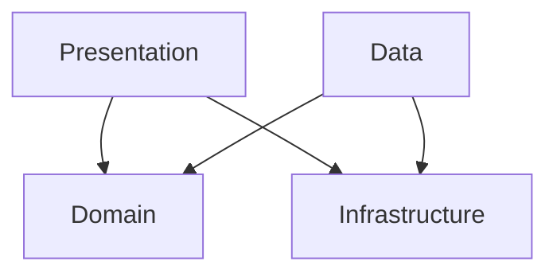

# KakaoImageSearch

카카오 이미지 검색 API를 활용한 이미지 검색 및 북마크 iOS 앱입니다.

---


## 기술 스택

| 항목 | 내용 |
|------|------|
| **언어** | Swift 6.0 (Strict Concurrency) |
| **UI** | SwiftUI |
| **최소 타겟** | iOS 17.0 |
| **외부 라이브러리** | 없음 (Zero dependency) |
| **테스트** | Swift Testing Framework |
| **로깅** | OSLog (카테고리별 필터링) |

---

## 아키텍처

Clean Architecture + MVVM을 기반으로 4개 레이어로 구성했습니다.

```
KakaoImageSearch
├── Domain          # 비즈니스 규칙 (Entity, UseCase, Repository Protocol)
├── Data            # 외부 데이터 (DTO, Repository 구현체, Storage)
├── Infrastructure  # 인프라 (Network, ImageLoader, L10n, Logger)
└── Presentation    # UI (View, ViewModel)
```

### 레이어 의존 방향



Domain은 외부에 의존하지 않으며, Data와 Presentation이 Domain과 Infrastructure의 인터페이스에 의존합니다.

---

## 주요 구현

### Swift 6 Strict Concurrency
- `SWIFT_DEFAULT_ACTOR_ISOLATION = MainActor` 설정으로 전체 타입 기본 격리
- `actor`: NetworkService, BookmarkStorage, ImageDownloader, ImageCache
- `@Observable @MainActor final class`: 모든 ViewModel
- `nonisolated`: actor 격리가 필요하지 않은 APIEndpoint, Logger, DTO 초기화, L10n 등에 명시적으로 적용

### 자체 구현 컴포넌트 (외부 라이브러리 미사용)
| 컴포넌트 | 구현 내용 |
|----------|-----------|
| **NetworkService** | `actor` 기반 Generic URLSession 래퍼, snake_case 자동 변환 |
| **ImageDownloader** | 메모리(NSCache) + 디스크 2단계 캐시, in-flight 중복 요청 dedup, URLSession 주입 가능 |
| **CachedAsyncImage** | `.task(id: url)` 기반 이미지 로더 — 뷰 수명과 Task 수명 일치, URL 변경 시 자동 리셋 |
| **AppAssembler** | Composition Root 패턴, 주요 의존성은 AppAssembler에서 조립하도록 구성했습니다. |
| **BookmarkStorage** | FileManager + JSON 파일 기반 영속성, `.atomic` 쓰기 |

### 검색 Debounce 및 취소 처리
- `Task.sleep(for: .seconds(1.0))` + `Task.cancel()` 조합으로 1.0초 debounce 구현
- `searchTask`로 진행 중인 검색 Task를 추적해 새 검색 시 이전 Task 명시적 취소
- `NetworkService`에서 `CancellationError` / `URLError(.cancelled)` 를 `NetworkError`로 감싸지 않고 그대로 전파해 취소와 실제 오류를 명확히 구분
- `activeSearchID`(UUID)로 stale 응답 무시 — 취소 신호가 미처 전달되기 전에 응답이 도착해도 이전 검색의 결과를 UI에 반영하지 않음
- `submitSearch`는 `@discardableResult Task<Void, Never>` 반환 — 프로덕션에서는 결과를 무시하고, 테스트에서는 `.value`로 await해 결정적 타이밍 보장

### 무한 스크롤 페이지네이션
- Kakao API의 `page` 파라미터를 활용해 추가 결과를 자동 로드
- `LazyVGrid` 마지막 아이템 `.onAppear` 시점에 `loadMore()` 호출
- API의 `isEnd` 플래그로 마지막 페이지 판별

### 네트워크 오류 재시도 UX
- 검색 실패(hasError) 시 EmptyStateView에 재시도 버튼 표시
- 추가 로드 실패(hasLoadMoreError) 시 목록 하단에 인라인 재시도 버튼 표시
- 결과 없음(빈 배열)과 실제 오류를 명확히 구분

### 북마크 에러 Toast 피드백
- 북마크 토글 실패 시 검색 결과를 유지한 채 하단 Toast로 표시
- `errorMessage`(검색 실패 전용)와 `toastMessage`(일시적 에러 전용) 역할 분리
- Toast는 3초 후 자동 소멸, 슬라이드 인/아웃 애니메이션 적용

### BookmarkStore (단일 진실 공급원)
- `Presentation/Store/`에 위치한 Presentation 레이어 공유 상태 객체
- `@Observable @MainActor`로 선언해 북마크 상태를 중앙 관리
- `SearchViewModel` / `BookmarkViewModel` 이 동일 인스턴스를 참조해 양쪽 탭에서 같은 북마크 상태를 참조하도록 구성했습니다.

### iPad 적응형 레이아웃
- `horizontalSizeClass` 기반으로 iPhone / iPad 레이아웃 분기
- **iPhone (compact)**: 기존 `TabView` 유지
- **iPad (regular)**: `NavigationSplitView`로 검색(사이드바) + 북마크(디테일) 동시 표시
- 이미지 목록: `LazyVGrid` 2열, 좌우 패딩 20pt, 컬럼 간격 20pt

### 다국어 지원 (ko / en / ja)
- `.xcstrings` String Catalog 기반
- `L10n` 헬퍼를 사용해 문자열 접근을 정리했습니다

### OSLog 기반 로깅
- `Logger.network`, `Logger.imageLoader`, `Logger.bookmark`, `Logger.presentation` 카테고리 분리
- `debugPrint` / `errorPrint` 헬퍼로 `OS_ACTIVITY_MODE=disable` 환경에서도 Xcode 콘솔 출력 보장

---

## 테스트

### 유닛 테스트

Swift Testing Framework 기반 81개 테스트 케이스를 작성했고, 로컬 기준으로 모두 통과했습니다.

| 테스트 Suite | 케이스 수 | 주요 검증 항목 |
|---|---|---|
| `ImageItemTests` | 17 | aspectRatio 경계값, Codable 라운드트립, Hashable, listDisplayURL/detailDisplayURL fallback |
| `SearchImageUseCaseTests` | 7 | 북마크 상태 merge, 에러 전파 |
| `ManageBookmarkUseCaseTests` | 10 | toggle add/remove, 중복 방지 |
| `KakaoImageSearchEndpointTests` | 11 | URL 구성, 쿼리 파라미터, 헤더 검증 |
| `KakaoSearchResponseDTOTests` | 8 | JSON 디코딩, snake_case 변환, 필드 fallback |
| `SearchViewModelTests` | 20 | 검색 성공/실패, 취소/race condition 처리, 페이지네이션, 재시도, 북마크 토글/Toast |
| `BookmarkViewModelTests` | 4 | 목록 로드, 삭제 후 갱신, 삭제 실패 Toast |
| `MainViewModelTests` | 4 | debounce 취소, 빈 입력 처리 |

Domain과 ViewModel 중심으로 테스트를 작성했습니다.

### 통합 테스트

Swift Testing Framework 기반 26개 테스트 케이스, 작성한 테스트는 로컬 기준으로 모두 통과했습니다.

| 테스트 Suite | 케이스 수 | 주요 검증 항목 |
|---|---|---|
| `NetworkServiceIntegrationTests` | 8 | MockURLProtocol 기반 실제 URLSession 요청/응답, 에러 매핑 |
| `BookmarkStorageIntegrationTests` | 12 | 실제 FileManager 파일 I/O, 저장/조회/삭제 시나리오 |
| `ImageDownloaderIntegrationTests` | 6 | MockImageURLProtocol 기반 다운로드 성공/실패, 캐시 히트, in-flight dedup, http→https 변환 |

### UI 테스트

XCUITest 기반 25개 테스트 케이스를 작성했고, 로컬 기준으로 모두 통과했습니다.

| 테스트 Suite | 케이스 수 | 주요 검증 항목 |
|---|---|---|
| `KakaoImageSearchIPhoneUITests` | 11 | 앱 실행, 검색창 인터랙션, 탭 전환, 검색 결과 (`--useFixtureData` fixture 기반, iPhone 전용) |
| `KakaoImageSearchIPhoneRetryUITests` | 4 | 네트워크 오류 시 재시도 버튼 UX (`--simulateNetworkError`, iPhone 전용) |
| `KakaoImageSearchIPadUITests` | 6 | NavigationSplitView 구조, 양쪽 패널 동시 표시 (`--useFixtureData` fixture 기반, iPad 전용) |
| `KakaoImageSearchIPadRetryUITests` | 4 | 네트워크 오류 시 재시도 버튼 UX, 에러 후 양쪽 패널 유지 (iPad 전용) |

---

## 실행 방법

1. 저장소 클론
2. `KakaoAPIKey.swift` 파일을 프로젝트 루트에 생성

```swift
// KakaoAPIKey.swift
enum KakaoAPIKey {
    static let restAPIKey = "여기에_REST_API_키_입력"
}
```

3. Xcode에서 `KakaoImageSearch.xcodeproj` 실행
4. iOS 17.0 이상 시뮬레이터 또는 실기기에서 빌드 & 실행

> `KakaoAPIKey.swift`는 `.gitignore`에 등록되어 있습니다.

---

## 프로젝트 구조

```
KakaoImageSearch/
├── App/                        # AppAssembler (Composition Root)
├── Infrastructure/
│   ├── ImageLoader/            # ImageDownloader, ImageCache, CachedAsyncImage
│   ├── Logger/                 # AppLogger (OSLog extension)
│   ├── Network/                # NetworkService, NetworkError, APIEndpoint
│   └── L10n.swift              # 다국어 헬퍼
├── Domain/
│   ├── Entity/                 # ImageItem
│   ├── Repository/             # ImageSearchRepository, BookmarkRepository (Protocol)
│   └── UseCase/                # SearchImageUseCase, ManageBookmarkUseCase
├── Data/
│   ├── API/                    # KakaoImageSearchEndpoint
│   ├── DTO/                    # KakaoSearchResponseDTO
│   ├── Repository/             # DefaultImageSearchRepository, DefaultBookmarkRepository
│   └── Storage/                # BookmarkStorage
└── Presentation/
    ├── Store/                  # BookmarkStore (Presentation 레이어 공유 상태)
    ├── Main/                   # MainView, MainViewModel
    ├── Search/                 # SearchView, SearchViewModel, SearchResultItemView
    ├── Bookmark/               # BookmarkView, BookmarkViewModel
    └── Components/             # SearchBar, BookmarkButton, EmptyStateView
```
